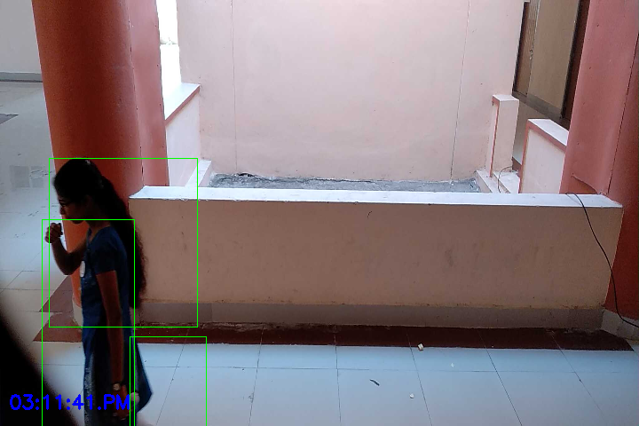

# Motion Capturing Camera for Survilliance Systems

---

---

- This project is about transforming a normal CCTV into a motion capturing CCTV so that it records only the video frames which have movement in them. Likewise, we can save memory usage in the computer's hard disk by recording only wanted video frames that have movement instead of all unwanted video frame

- Nowadays we see, all the cctvs' will record and save 24 hrs' footage, in which 80% is unwanted footage (i.e 80% of the footage contains no person passing by, and that footage is no use for us) and rest 20% footage is only useful (i.e 20% footage contains persons passing by and wanted details). Thus , this 80% leads to the wastage of hard-disk's memory. So, my project is to save hard-disks' memory.
  Thus we can record and save only that 20% footage and couldn't record that 80% unwanted footage.
  This project is purely based on motion detection capturing.

---

## Requirements

- Install Python(3.9 or above)
  - Install it from [here](https://www.python.org/downloads/)
  - Mac users ` brew install python`
- Install Pipenv
  - Dependency and env manager for python
  - `brew install pipenv`

## Setup

- Clone the repo

- Change to project's main directory
  ` cd MotionCapturingCameraForSuvillianceSystems/`

- Activate a virtual enviroinment
  `pip env shell`

- Install required dependencies
  ` pip install --ignore-pipfile`

## Run

- Know which arguments to use.
  `python3 main_cctv.py --help`
- Run the project using laptop webcam.
  `python3 main_cctv.py -w 0`
- Run the project using external cam url.
  ` python3 main_cctv.py -u {url}`
  - (url is like ip_webcam url {http://192.168.121.1:8080/shot.jpg} ) it uses external cameras.
